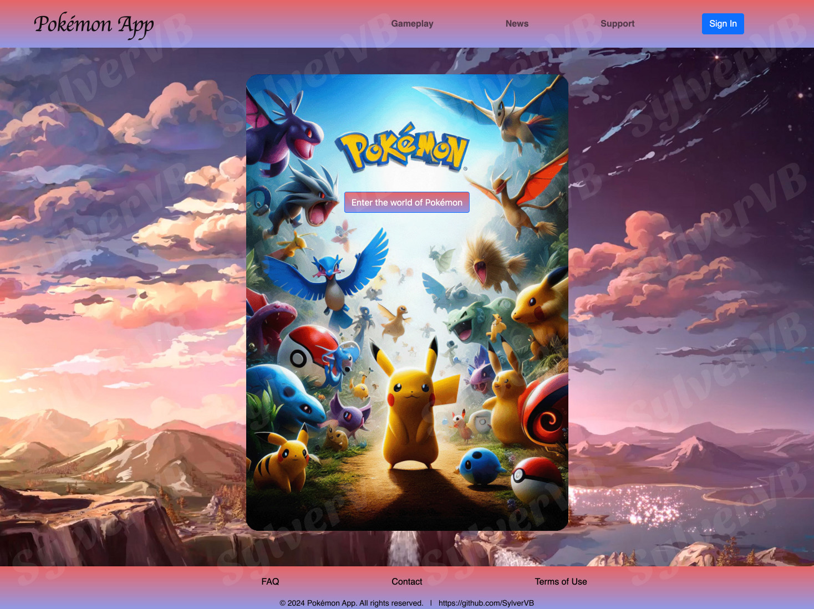
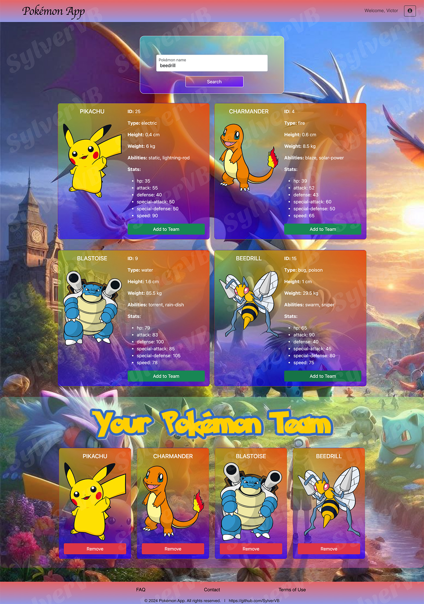

# Pokémon App

Welcome to the Pokémon App! This application allows users to search for Pokémon, view detailed information, and build a team. It is built using HTML, CSS, and JavaScript with the help of Bootstrap for responsive design.

## Table of Contents

- [Pokémon App](#pokémon-app)
  - [Table of Contents](#table-of-contents)
  - [Project Overview](#project-overview)
  - [Features](#features)
  - [Installation](#installation)
  - [Usage](#usage)
    - [Searching for Pokémon](#searching-for-pokémon)
    - [Building a Team](#building-a-team)
    - [User Authentication](#user-authentication)
  - [Technologies Used](#technologies-used)
  - [Screenshots](#screenshots)
    - [Home Page](#home-page)
    - [Pokémon Display Page](#pokémon-display-page)
  - [File Structure](#file-structure)
  - [Contributing](#contributing)
  - [License](#license)
  - [Contributors License Agreement (CLA)](#contributors-license-agreement-cla)

## Project Overview

Welcome to the Pokémon App! This project is an engaging platform for Pokémon enthusiasts to explore and interact with Pokémon data. The application leverages the PokéAPI to fetch detailed information about various Pokémon and presents it in a user-friendly manner. Users can search for their favorite Pokémon, view their stats, abilities, and more, and add them to a team. The app is designed to be intuitive and responsive, ensuring a seamless experience across devices.

## Features

- **Responsive Design:** Optimized for various screen sizes using Bootstrap.
- **Pokémon Search:** Search for Pokémon by name and view detailed information such as stats, abilities, and images for each Pokémon.
- **Team Builder:** Add and remove Pokémon from a personal team.
- **User Authentication**: Sign In and Sign Up modals for user-friendly authentication.

## Installation

To run this project locally, follow these steps:

1. **Clone the repository:**
   ```bash
   git clone https://github.com/SylverVB/FE-HW-W3WD-Bootstrap-JavaScript-Pokemon-API-Integration-Project.git
   ```

2. **Navigate to the project directory:**
   ```bash
   cd FE-HW-W3WD-Bootstrap-JavaScript-Pokemon-API-Integration-Project
   ```

3. **Open `index.html` in your preferred web browser.**

## Usage

### Searching for Pokémon

1. Open the app and navigate to the search page by clicking "Enter the world of Pokémon" on the homepage.
2. Enter the name of the Pokémon you wish to search for and click "Search".
3. View the Pokémon details including stats, abilities, and type.

### Building a Team

1. After searching for a Pokémon, click the "Add to Team" button to add it to your team.
2. View your team in the "Team Builder" section.
3. To remove a Pokémon from your team, click the "Remove" button next to the Pokémon you wish to remove.

### User Authentication

- Use the "Sign In" button in the navigation bar to sign in to your account.
- If you are new, use the "Sign Up" link in the sign-in modal to create a new account.

## Technologies Used

- **HTML5**: For structuring the web pages.
- **CSS3**: For styling the web pages.
- **Bootstrap 5**: For responsive layout and styling.
- **JavaScript**: For dynamic content and interactivity.
- **PokéAPI**: For fetching Pokémon data.

## Screenshots

### Home Page



### Pokémon Display Page



## File Structure

```pokemon-app/
│
├── index.html
├── search.html
├── static/
│   ├── style.css
│   ├── script.js
│   └── images/
│       ├── vbmountainbackground.jpeg
│       ├── vbpokemonipad.png
│       ├── vbpokemonbackground.jpeg
│
└── screenshots/
    ├── vbpokemonhomepage.jpg
    └── vbpokemonteam.jpg
```

## Contributing

Contributions are welcome! If you have suggestions or improvements, please create a pull request or submit an issue.

1. Fork the repository.
2. Create a new branch (`git checkout -b feature-branch`).
3. Commit your changes (`git commit -m 'Add some feature'`).
4. Push to the branch (`git push origin feature-branch`).
5. Create a new Pull Request.

## License

This application is the property of Victor Bondaruk. As the owner, [Victor Bondaruk](https://github.com/SylverVB) retains all rights to the application.

## Contributors License Agreement (CLA)

By making a contribution to this project, you agree to the following terms and conditions for your contributions:

1. You grant the owner, Victor Bondaruk, a perpetual, worldwide, non-exclusive, no-charge, royalty-free, irrevocable license to use, distribute, and modify your contributions as part of this project.
2. You represent that you are legally entitled to grant the above license.
3. You agree to promptly notify the owner of any facts or circumstances of which you become aware that would make these representations inaccurate in any respect.

---

Feel free to explore and contribute to the Pokémon App. Happy Pokémon hunting!